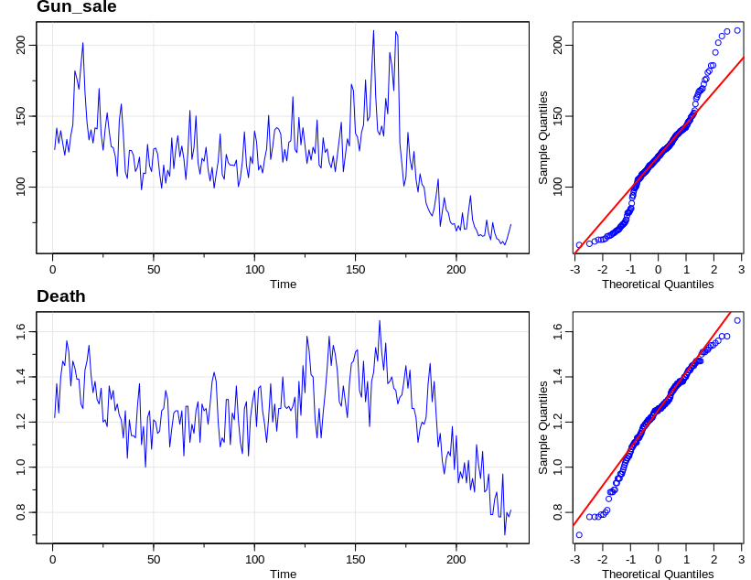
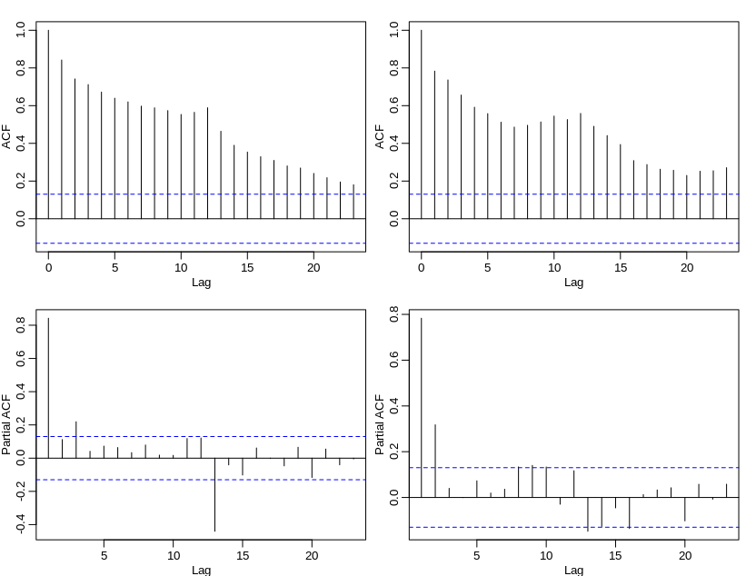
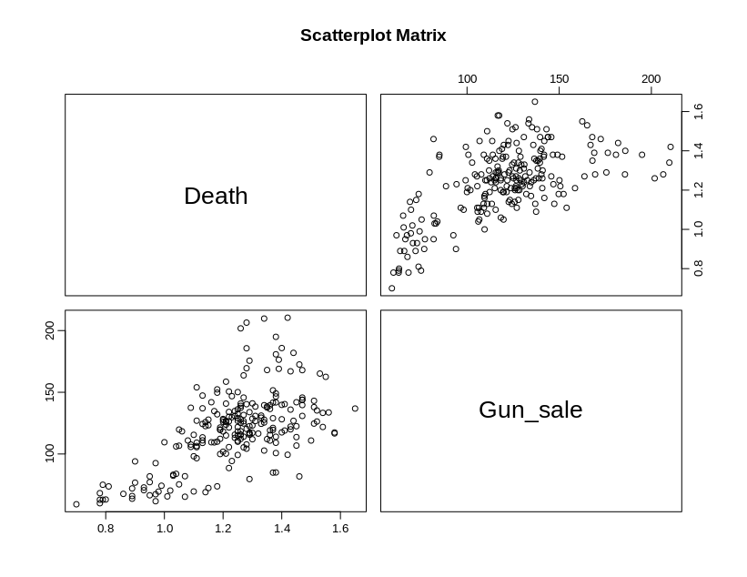
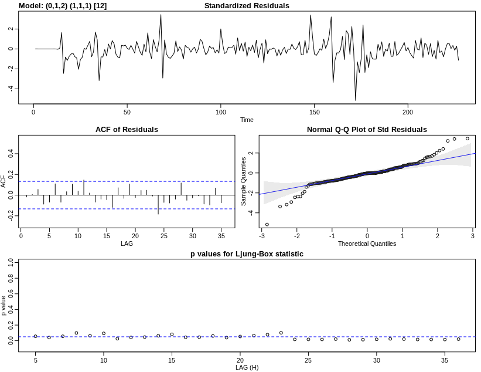
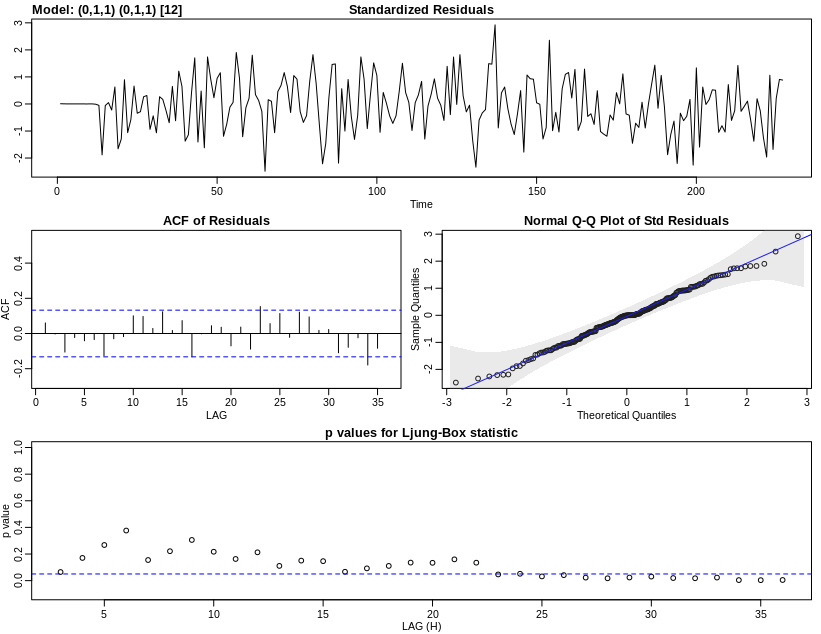
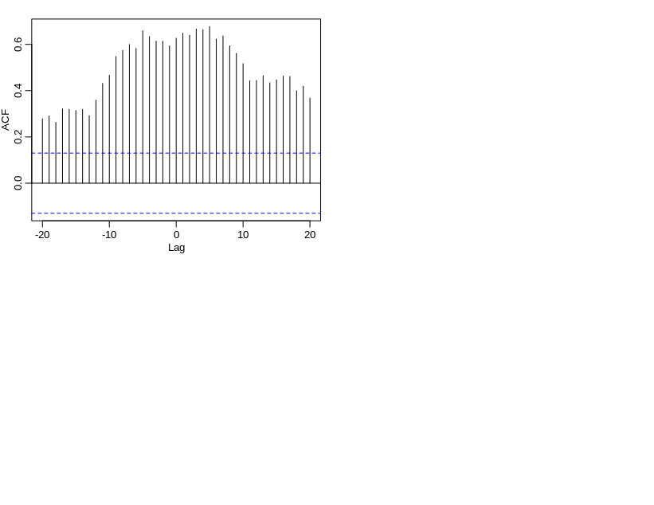
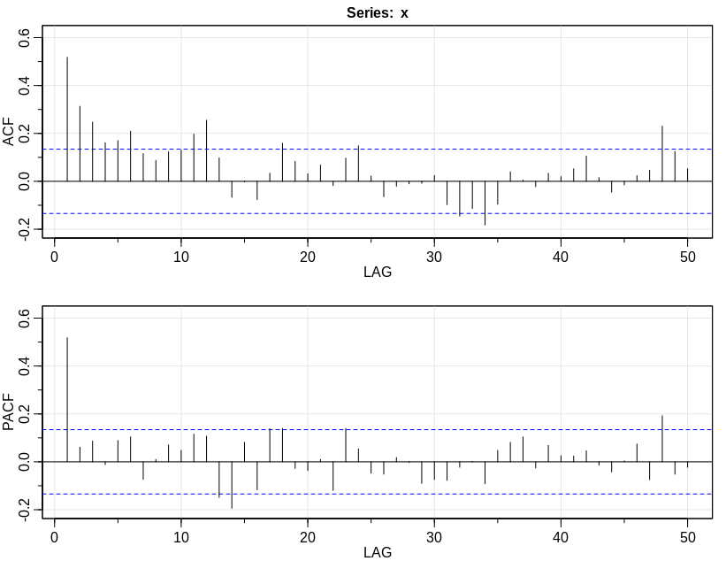
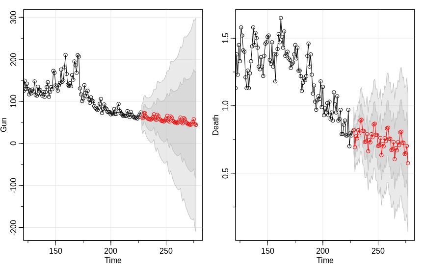

# Time_series_analysis_gun_and_death

The monthly handgun sales and firearms related deaths data (GD data) in California is the monthly observations at 227 times point in 1980-1998. The project studys the relationship and seasonal compnents between Gun and Death data.

Time series analysis for two veriables and the correlations between them result is shown below.

## Variations over time

##  ACF and PACF of times series (a) Gun_sale,(b) Death

##  Scatter matrix between Death and gun_sale

_and_▽(Gun_sale).png)
## Time plot and QQ plot of log(Gun_sale) and ▽(Gun_sale)

.png)
## ACF and PACF of ▽(Gun_sale)

.png)
## ACF and PACF of ▽▽12(Gun_sale)

## Diagnose  plot for SARIMA model of Gun_sale data

_and_▽(Death).png)
## Time plot and QQ plot of log(Death) and ▽(Death)

.png)
## ACF and PACF of ▽(Death)

.png)
## ACF and PACF of ▽▽12(Death)

## Diagnose  plot for SARIMA model of Death data

## Cross correlation function between gun_sale and death

## ACF and PACF of residuals

.png)
## ACF and PACF of ▽▽12(residuals)

x(0,1,1)[12].png)
## Diagnose plot of SARIMA(0,1,1)x(0,1,1)[12]

x(1,1,1)[12].png)
## Diagnose plot of SARIMA(0,1,1)x(1,1,1)[12]

## Prediction plot
